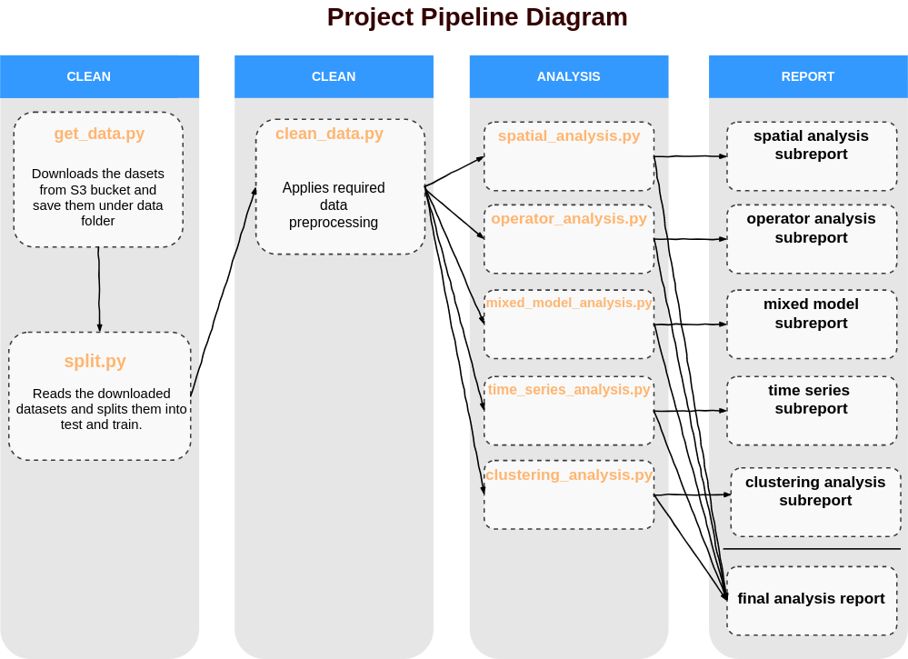

# Vision over Transit Incidents & Claims

Contributors: 

 - Brayden Tang, brayden.tang1@gmail.com
 
 - Xugang Zhong, chuusankirk@hotmail.com
 
 - Merve Sahin, kymerve16@gmail.com
 
 - Simardeep Kaur, simardeep.kaur.jeji@gmail.com
 

 This is a mentored group project for the Master of Data Science program at the University of British Columbia with the business parther Business Technology Services (BTS) and Insurance Claims groups of TransLink.
 
## Overview
  
Translink paid \$20 million to ICBC for insurance claims during 2019/2020 in addition to $1.6 million in premiums to their captive insurance company, Transportation. Additionally, the premium paid by TransLink has increased by more than 200% during the last five years. The project builds upon the identification of potential factors responsible for the occurrence of incidents. To reduce the count of incidents in the future, statistical methods such as zero-truncated regression, time series modeling, and mixed-effect models will be leveraged in order to identify the incident patterns and factors that are predictive of incident frequency.

The research objectives are to:

1. Characterize current patterns of incident frequency in terms of variables related to drivers and vehicles
2. With the help of external data such as weather conditions and geographic data, examine how predictive these variables are of incidents/claims
3. Recommend actions for TransLink to reduce the incident frequency strategically


## Report

Our report can be found [here](https://github.com/UBC-MDS/TransLink/tree/master/doc/interactive-report)

## Usage

The flow diagram below illustrates the overviews our analysis process and illustrates script orders and dependencies.



To replicate the analysis, clone this GitHub repository, install the [dependencies](#dependencies) listed below, and run the following commands at the command line/terminal from the root directory of this project:

```make all```

To reset the repo to a clean state, with no intermediate or results files, run the following command at the command line/terminal from the root directory of this project:

```make clean```

## Dependencies

- Python 3.7.3 and Python packages:
  - docopt==0.6.1
  - leaflet==2.0.3
  - mapview==2.7.8
  - tidyverse==1.3.0
  - readxl==1.3.1
  - janitor==1.2.0
  - caret==6.0.85
  - VGAM==1.1.2
  - brms==2.12.0
  - parallel==3.6.2
  - recipes==0.1.9
  - bayesplot==1.7.1
  - pandas==0.24.2
  - numpy==1.17.2
  - altair==3.2.0
  - selenium==3.141.0
  - googlemaps==4.3.1
  - boto3==1.12.31

- GNU make 4.2.1

- ChromeDriver 79.0.3945.36

*Note: ChromeDriver is required for saving Altair plots that are produced in our EDA analysis and then rendered in reports. If you are having issues producing Altair plots or installing ChromeDriver, please consult these links for help: [saving Altair plots](https://altair-viz.github.io/user_guide/saving_charts.html), [installing ChromeDriver](https://sites.google.com/a/chromium.org/chromedriver/)*

    
## References


