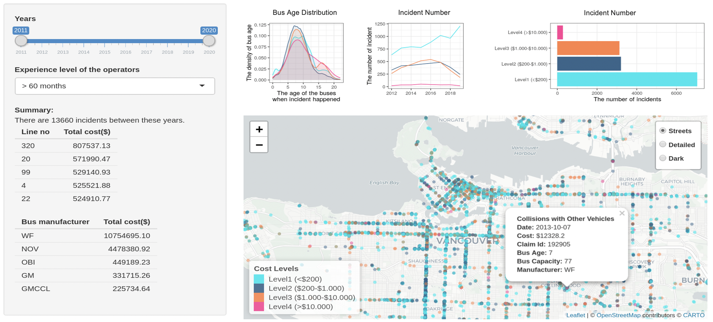
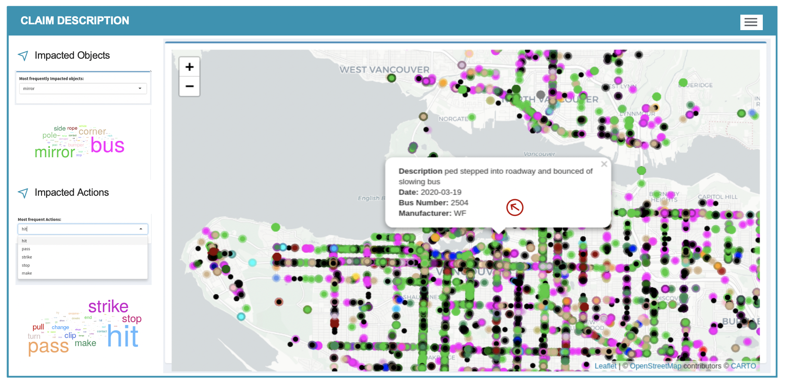
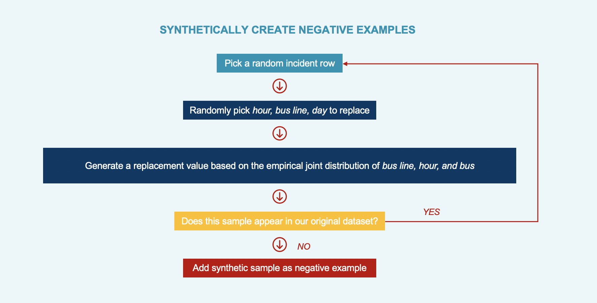
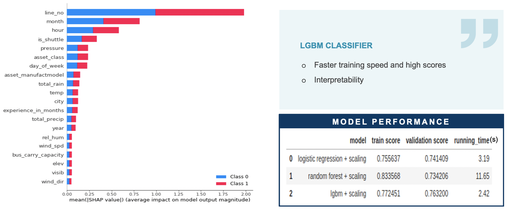
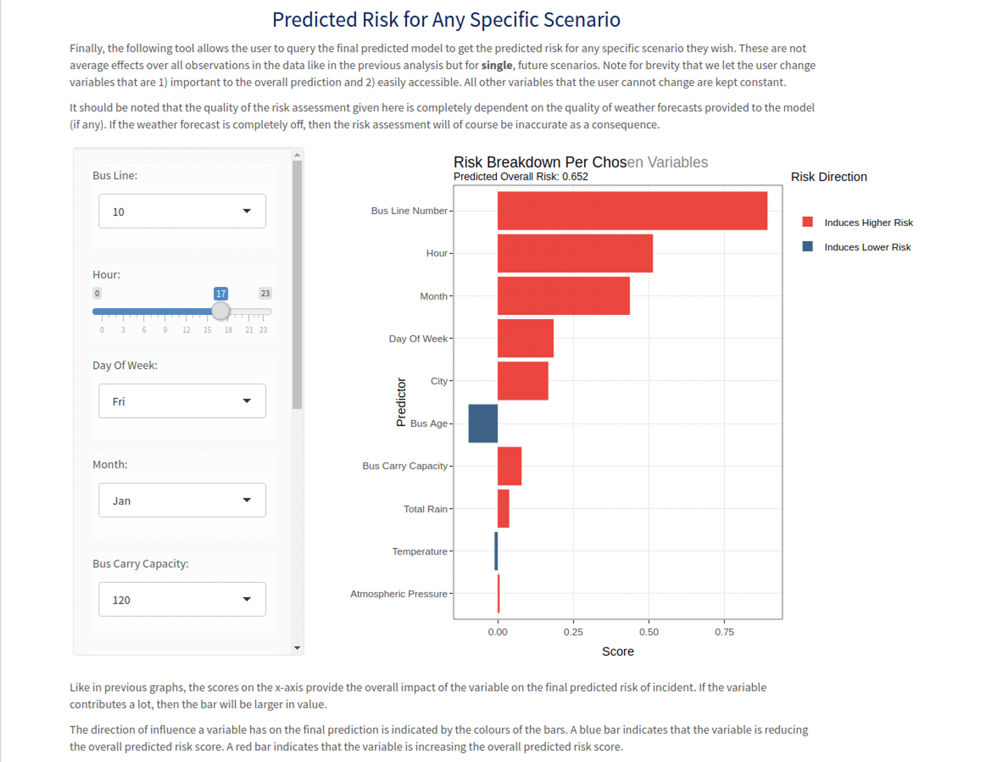

```{r setup, include=FALSE}
knitr::opts_chunk$set(cache=TRUE,
                      message=FALSE, warning=FALSE,
                      fig.path='figs/',
                      cache.path = '_cache/',
                      fig.process = function(x) {
                      x2 = sub('-\\d+([.][a-z]+)$', '\\1', x)
                      if (file.rename(x, x2)) x2 else x
                      })
```


# SUMMARY

To identify the transit incident pattern, the spatial analyses of both claim cost and claim description are employed and a comprehensive machine learning model is built to assess the overall predictive power of all of these various factors such as bus line, weather conditions, time and bus characteristics by using LightGBM classifier. The bus line turned out to be the most important variable in determining how likely an incident is to occur for any scenario. All these analyses together with findings and recommendations are integrated in an interactive report.


# INTRODUCTION

With the largest transit service area in Canada, TransLink is operating more than 245 bus routes and 79 kilometers of rapid transit to meet the transportation needs of 2.5 million people in Metro Vancouver as of the end of 2018 (TransLink 2018). Legislation requires TransLink to carry a $1 million per occurrence liability policy on each of its revenue vehicles and a \$200,000 per occurrence liability policy on each of its non-revenue vehicles. Since 2014/2015, the premium paid to ICBC has increased by over 200% to cover onboard passenger injuries, cyclist injuries, pedestrian injuries, and losses from collisions with third party vehicles. For at-fault physical damage losses to its vehicles, the premium paid to its own captive insurance company has increased by 33%.

In response to soaring insurance costs and road safety concerns, a variety of statistical and machine learning methods are employed to address the research questions. We analyzed key variables of interest that may be predictive of bus incidents. These variables include an analysis of the operators involved, the impact of bus characteristics, and the effect of weather, time, location, and line number on the likelihood of an incident occurring. Meanwhile, the types of claims that are occurring - in particular, if there are common types of claims per location and if particular locations yield large paid costs were also analyzed. 


# DATA SCIENCE METHODS

Three categorical analyses were conducted including spatial analysis with the format of an interactive map, and incident analysis based on a comprehensive machine learning model. 

**Spatial Analysis- Claim Cost**

One of the primary concerns for TransLink was soaring insurance costs in recent years.In that context, TransLink was interested in causal/exploratory analysis as well as cost prediction for upcoming months. However, after analyzing the available datasets, we figured out that almost half of the claims are still open and there were no negative examples in which the bus completed its route without any incidents (hence without any cost). A predictive machine learning model on the insurance costs would be potentially highly biased since the insurance costs cannot be assessed accurately. Therefore, the best approach to get more insights into the increasing insurance costs was using exploratory data analysis techniques. For that purpose, we developed an interactive map tool to easily check and explore the details of the collisions/costs on a real city map. The exact locations and some detailed information about the incidents can be easily seen and the comparison between different neighborhoods in terms of the number of incidents can be done. The map also shows how the different levels of operators’ experience affect the number of incidents and how these trends evolved. The map is colored according to the levels of cost range to see how the cost range differs in different neighborhoods. 


_Figure 1: Screenshot of the interactive map of claim cost_


**Spatial Analysis- Claim Description**

We deployed Natural Language Processing in our claim description analysis. The idea is extracting nouns and verbs from the incident/claim descriptions. Nouns extracted from narrative sentences contain information about what objects were impacted in the incident and verbs will tell us about the granular level of the impact of the incident.


_Figure 2: Screenshot of the interactive map of claim description_

**Incident Analysis**

TransLink's overall goal is to identify certain factors that are highly correlated with operator incidents. Through this analysis, TransLink hopes that through the identification of specific factors, certain preventable measures can be taken to help reduce insurance costs. In particular, TransLink has expressed interest in understanding the impact of weather conditions, bus characteristics, location, and time in addition to operator characteristics  to get a better understanding of what is actually driving bus incidents.

We employed a machine learning model to simultaneously assess the overall predictive power of all of these various factors using a very similar methodology to what is described in two papers ([@Montreal] and [@WilsonML]).



_Figure 3: Synthetically create negative examples_


We trained many different machine learning models on our synthetic dataset including Logistic Regression, but LightGBM gave the best overall performance (ROC/AUC) and also relatively interpretable thanks to SHAP scores. On average, the model shown here correctly ranks a scenario with an actual incident to be of higher risk than a scenario with no incident, 85% of the time. This is in line with the papers in which this model is based on. 




_Figure 4: Model Output_


# DATA PRODUCT AND RESULTS

Employing a variety of statistical and machine learning methods, we have a very user-friendly interactive report as our data product. The interactive report is divided into six sections:

- Executive Summary
- Predictive Power of Location and Operator Experience
- A Combined Analysis of All Factors Using Machine Learning
- Common Types of Claims by Location
- Assessment of Claims Costs by Location
- Future Analysis




_Figure 5: A glance of the interactive report_

# CONCLUSION AND RECOMMENDATION

We summarize the key points of this entire analysis:

- The bus line is by far the most important variable in determining how likely an incident is to occur for any scenario. The bus lines that path-specifically through Downtown Vancouver, with the exception of bus line 41, are the lines that have the highest risk of incidence. As a result, a large amount of risk can be mitigated simply by focusing on improving safety measures for all lines that move through Downtown Vancouver.

- The months of June, July, and September are roughly 1.5 times less likely to have an incident than all other months. Lower risk in June and July is possibly the result of lower ridership and traffic congestion (due to the Summer holidays) but it is not clear as to why September is noticeably safer when compared to the others.

- 7 am and 6 pm are the times that are most risky for incidents, however, there are clear intervals within this range that are relatively safer. For example, the morning rush hour (7 am to 9 am) is roughly 1.1 times less likely to have an incident when compared to 3 pm to 5 pm. 

- As seen previously, shuttles are roughly 1.3 times less likely of an incident when compared to non-shuttles. Furthermore, there is virtually no difference in risk among smaller and fuller sized regular buses.

- The bus age is surprisingly very predictive of incidents. Specifically, buses that are >= 24 years of age see an increased risk of an incident (about 1.3 times more) than buses that are relatively new (0 to 1 year old). Replacing busses in excess of 24 years of age as much as possible, or decommissioning buses earlier (such as before 24 years) can help mitigate the risk of incidence.

- Weather - specifically temperature and atmospheric pressure are both predictive of incidents. As the temperature increases, in general the risk of an incident decreases, however, after 30°C the risk of incident suddenly starts increasing again. A similar relationship holds for atmospheric pressure in which <100 kPA pressures in general, exhibit a higher risk of incidence (due to likely more rain). At around 103-104 kPA, however, there is a noticeable bump in risk. A possible theory for this could be the result of nicer days leading to more ridership and traffic congestion. Regardless, if temperatures are expected to be higher than 30°C or > 10 mm of precipitation is expected, warnings to operators to act more cautiously due to elevated risk of incidence could be a potential action TransLink could implement.


# REFERENCE
