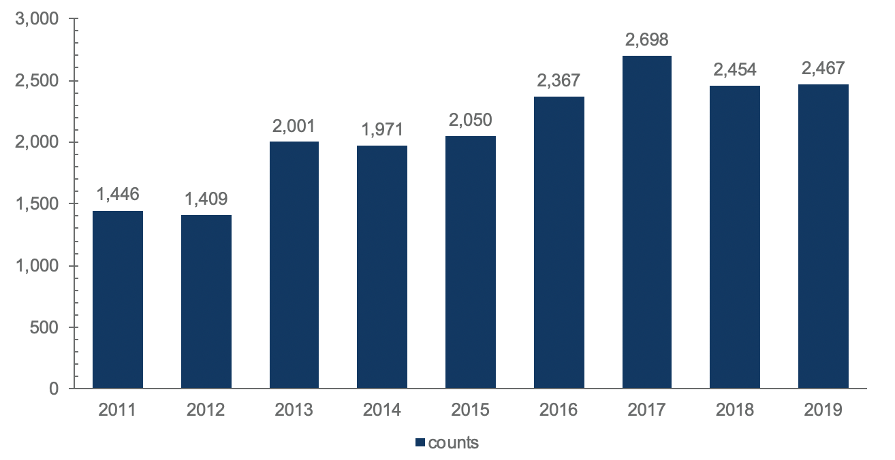
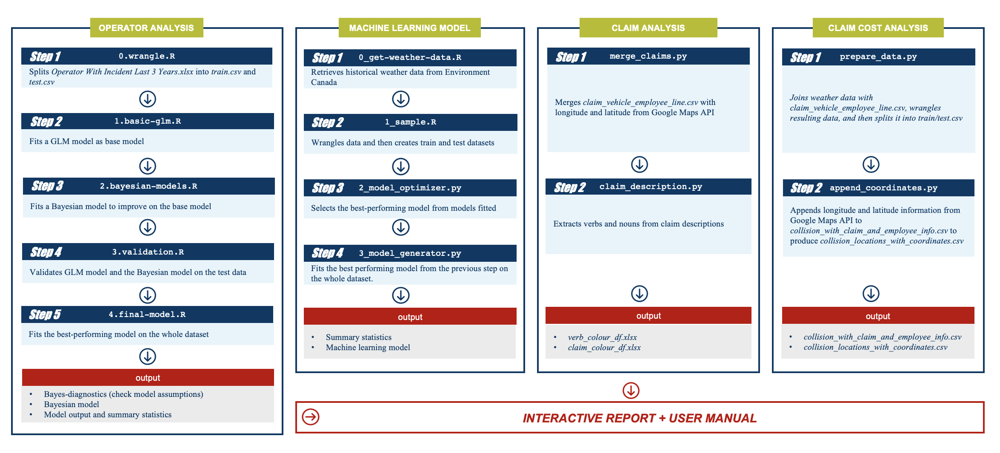
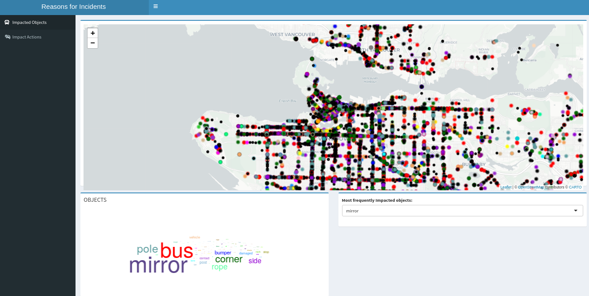

# SUMMARY

To identify the transit incident pattern, the spatial analyses of both claim cost and claim description are employed and a comprehensive machine learning model is built to assess the overall predictive power of all of these various factors such as bus line, weather conditions, time and bus characteristics by using LightGBM classifier. The bus line turned out to be the most important variable in determining how likely an incident is to occur for any scenario. All these analyses together with findings and recommendations are integrated in an interactive report.

# INTRODUCTION

With the largest transit service area in Canada, TransLink is operating more than 245 bus routes and 79 kilometers of rapid transit to meet the transportation needs of 2.5 million people in Metro Vancouver as of the end of 2018 (TransLink 2018). Legislation requires TransLink to carry a \$1 million per occurrence liability policy on each of its revenue vehicles and a \$200,000 per occurrence liability policy on each of its non-revenue vehicles. Since 2014/2015, the premium paid to ICBC has increased by over 200% to cover onboard passenger injuries, cyclist injuries, pedestrian injuries, and losses from collisions with third party vehicles. For at-fault physical damage losses to its vehicles, the premium paid to its own captive insurance company has increased by 33%.

_Figure 1: Incident Counts by Year_

Using internal data provided by TransLink, weather data from Environment Canada and geographical data extracted from Google Maps, we  identify specific variables that are highly predictive of bus incidents (defined as accidents that have the potential to result in a claim against TransLink) so that TransLink can make data-driven decisions to help reduce the number of incidents (and therefore, claims). In addition, two interactive dashboards were built to analyze common types, and the overall cost impact of claims resulting from these incidents. Using these dashboards, TransLink can hopefully assess in finer detail what is actually driving up their insurance costs. In the end, all the analyses were embedded in a fully reproducible interactive report, which can be accessed easily with Docker.

# DATA SCIENCE METHODS

Overall, the project comprises four sections in which the first two sections deal primarily with the analysis of variables that may be linked to the frequency of bus incidents. The last two sections analyze data related to the actual claims that result from these incidents - in particular, claim descriptions and claim costs. 

_Figure 2: Methodology Flow Chart_

**Incident Analysis**

The first section deals with an analysis of bus operator characteristics which is what TransLink currently uses to assess incident risk. In this section, both experience level and operator cost centre were analyzed in detail to determine the effect (if any) these variables have on the number of incidents per year an operator is involved in. In the end, a Bayesian hierarchical model was used after it was found to compare favourably on held out data against other simpler methods. 
The second section can be viewed as an extension of the first one, with the key difference being that weather, time, bus line, and bus characteristic variables are used in addition to the operator characteristics previously mentioned. The methods used here incorporated a state-of-the-art machine learning approach to assess the relative risk of any scenario described by these variables. We employed a machine learning model to simultaneously assess the overall predictive power of all of these various factors using a very similar methodology to what is described in two papers ([@Montreal] and [@WilsonML]).

We trained many different machine learning models on our synthetic dataset including logistic regression, but LightGBM gave the best overall performance (ROC/AUC) and was also relatively interpretable thanks to SHAP scores.

_Figure 3: Plot of Generating Negative Examples_

**Spatial Analysis- Claim Cost**

TransLink expressed interest in a potential causal or exploratory analysis to figure out what variables cause bus incidents, as well as claim cost forecasts for upcoming months. However, after analyzing the available datasets, we observed that almost half of TransLink claims   have not been resolved, and as such the final costs for these claims are unknown.  Additionally, there were no negative examples in which the bus completed its route without any incidents (and hence, without any cost). Thus, a predictive machine learning model on the claim costs would be potentially highly biased since open claims naturally have their final costs understated. Therefore, we opt for the use of exploratory data analysis techniques instead and developed an interactive map to easily check and explore the claim costs associated with a particular incident (if they exist). 

For that purpose, we developed an interactive map tool to easily check and explore the details of the collisions/costs on a real city map. The exact locations and some detailed information about the incidents can be easily seen and a comparison between different neighborhoods in terms of the number of incidents can be done. The map also shows how different levels of operator experience affect the number of incidents and how these trends have evolved over the years. The map is colored according to the levels of cost range to see how the claim costs differ between neighborhoods.

_Figure 4: Screenshot of the Interactive Map of Claim Cost_

**Spatial Analysis- Claim Description**

Different locations in the Greater Vancouver area have different geographies, planning structures, and roads, all of which could influence the type of incident that occurs. In addition, there exists manually written claim descriptions that describe the context of each incident that led to each claim within the claims data. These claim descriptions typically describe the type of object hit, as well as the part of the bus that was damaged. In light of these points, we create a dashboard containing interactive maps and a word cloud that quickly summarize the most frequent object(s) struck and the most common incidents for any particular location in Greater Vancouver. The size of each word corresponds to how frequent each word appears in the set of incidents being viewed on the map. Furthermore, the top five most frequent objects struck/type of accidents can be viewed in a drop-down menu which can be used as a filter to view these specific incidents on another map at the bottom of the dashboard. Through this dashboard, a better understanding of the specific kinds of claims that are frequently occurring (if any) can be established for any area, which can hopefully lead to more targeted preventable measures. To create the dashboard, claim descriptions were wrangled and then parsed by a pre-trained natural language processing model that assigned part of speech tags to each word in a description.

_Figure 5: Screenshot of the Interactive Map of Claim Description_

# DATA PRODUCT

Employing a variety of statistical and machine learning methods, we have a very user-friendly interactive report as our data product. The interactive report allows us to fully explain all analyses in a guided manner. In addition, it allows the end users to come to their own conclusions through the interactive plots. To ensure maximum reproducibility on all machines, we also built a [Docker container](https://hub.docker.com/r/btang101/tl_vision) and included a [Makefile](https://github.com/UBC-MDS/TransLink/blob/master/Makefile). Finally, instructions on how to run the report are located in the [README](https://github.com/UBC-MDS/TransLink/blob/master/README.md).

# CONCLUSION AND RECOMMENDATION

It turned out that the bus line was the most important variable in determining how likely an incident is to occur for any scenario. Specifically, the bus lines that pass specifically through Downtown Vancouver, with the exception of bus line 41, are the lines that have the highest risk of incidence. As a result, a large amount of risk can be mitigated simply by focusing on improving safety measures for all lines that move through Downtown Vancouver. Surprisingly, bus age is also very predictive of incidents. Specifically, buses older than 24 years of age are about 1.3 times more likely to be involved in an incident than newer buses (0 to 1 year old). Replacing busses in excess of 24 years of age as much as possible, or decommissioning buses earlier (such as before 24 years) can therefore help mitigate the risk of incidence. As anticipated, weather - specifically temperature and atmospheric pressure are proved to be predictive of incidents. In general, as the temperature increases the risk of an incident decreases, however, after 30°C the risk of incident suddenly starts increasing again. A similar relationship holds for atmospheric pressure in which <100 kPA pressures exhibit a higher risk of incidence (due to likely more rain). At around 103-104 kPA, however, there is a noticeable bump in risk. A possible theory for this could be the result of nicer days leading to more ridership and traffic congestion. Regardless, if temperatures are expected to be higher than 30°C or > 10 mm of precipitation is expected, warnings to operators to act more cautiously due to an elevated risk of incidence could be a potential action TransLink could implement.

Finally, from the dashboard involving the parsing of claim descriptions, it is apparent that mirrors are among the most frequently hit objects on a bus in any type of incident involving a collision. Claims related to mirrors are frequently occurring almost everywhere in the Greater Vancouver region including Downtown Vancouver (which as noted is by far the area with the largest risk of an incident). Coupled with the fact that claim costs appear to be driven mostly from a high frequency of low severity claims, it may be reasonable to think that a large portion of claims costs are coming from the replacement or repairing of mirrors that have been damaged in collisions. 

# REFERENCE
