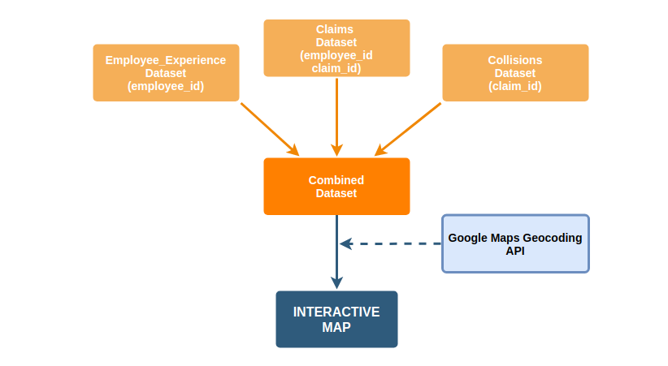

  
```{r setup, include=FALSE}
knitr::opts_chunk$set(echo = TRUE)
knitr::opts_knit$set(root.dir = here::here())
library(shiny)
library(tidyverse)
library(ggthemes)
library(leaflet)
library(mapview)
library(tidyverse)
library(lubridate)
library(htmlwidgets)
```

# Assessment of Claim Costs by Location

  One of the primary concerns for TransLink was soaring insurance costs in recent years. Concerning the insurance costs, TransLink was interested in causal/exploratory analysis as well as cost prediction for upcoming months. However, after analyzing the available datasets, we figured out that almost half of the claims are still open and there were no negative examples in which the bus completed its route without any incidents (hence without any cost). A predictive machine learning model on the insurance costs would be potentially highly biased since the insurance costs cannot be assessed accurately. Therefore, the best approach to get more insights into the increasing insurance costs was using exploratory data analysis techniques. For that purpose, we developed an interactive map tool to easily check and explore the details of the collisions/costs on a real city map. 
  
  There are many variables from different datasets that might have an impact on the insurance costs. Thus, as a first step in our analysis, we have built an extended dataset by joining the `2020 Collisions- Preventable and Non Preventable UBC Set Without Claim Number.csv`, `employee_experience_V2.csv` and also `claim_vehicle_employee_line.csv` datasets get more information about the collisions, operators and claims respectively. On the top of combined dataset, we populated the coordinates of each incident by using Google Maps GeoCoding API to be able to visualize them on the map. Then, we also used an R package `leaflet` to add interactivity on the map and `shiny` to add control elements to this dashboard.

```{r joining_datasets, echo=FALSE, out.width = '70%',  fig.align='center'}

```


  To provide better user experience, we first classified the costs into four levels as an indicator of severity of the collisions with the input from TransLink. Then we used *time* and *the experience level of the operators* as first-level filter elements in our interactive dashboard since they were two of the most apparent variables that affect the incidents according to the previous analysis.

Our primary element in the dashboard is the interactive map in the middle, which contains all reported incidents in the city map as a point, colored differently to indicate which cost level they belong to. In addition to the map, we also provided summary information that could help users to understand better. To achieve good coverage, we have used a combination of 

* Data tables; to show the number of incidents by city and total cost by bus line and bus manufacturer,
    
* Density plot; to show how bus ages are distributed for incidents,
    
* Line chart; to show the number of incidents changes over time,
    
* Histogram; to show the distribution of the number of incidents for each cost level.

$~$
  
```{r include=FALSE}
my_data <- read_csv("all_analysis/claim_costs/collision_locations_with_coordinates.csv")
my_data$years <- year(my_data$loss_date)
my_data <- my_data %>% mutate(apta_desc = ifelse(apta_desc == "Collisions With Other Vehicles (At G/C)", "Collisions With Other Vehicles", 
                                                 ifelse(apta_desc == "Collisions With Objects (At G/C)", "Collisions With Objects",  apta_desc)))
my_data$bus_age <- my_data$years - my_data$asset_vehicle_year
my_data$cost_range <- cut(my_data$`paid_cost$`, breaks = c(-Inf, 200, 1000, 10000, Inf),
                          labels=c("Level1 (<$200)","Level2 ($200-$1.000)","Level3 ($1.000-$10.000)", "Level4 (>$10.000)")) 
```


```{r include= FALSE}
ui <-  fluidPage(
  
  sidebarLayout(
    sidebarPanel(
      sliderInput("year", "Years", min(my_data$years), max(my_data$years),
                  value = range(my_data$years), step= 1, sep = ""),
      selectInput("experience", "Experience level of the operators",
                  choices = unique(na.omit(my_data$experience_levels))),
      htmlOutput("summary"),
      tableOutput("table3"),
      tableOutput("table1"),
      tableOutput("table2")
      
    ),
    mainPanel(
      fluidRow(column(4, plotOutput("plot1", width = "100%", height = "200px") ),
               column(4, plotOutput("plot3", width = "100%", height = "200px") ),
               column(4, plotOutput("plot2", width = "100%", height = "200px") ) ),
      
      
      br(),
      leafletOutput("map")
    ), 
  ))

server <- function (input, output) {
  
  year_data <- reactive({
    my_data %>% filter(years > input$year[1] & years < input$year[2])
  })
  
  output$map <- renderLeaflet({
    year_data() %>% 
      leaflet()  %>%
      addProviderTiles("CartoDB.Positron", group = "Streets") %>% 
      addProviderTiles("Esri.WorldImagery", group = "Detailed") %>% 
      addProviderTiles("CartoDB.DarkMatter", group = "Dark")   %>%
      setView(lng = -123.1171, lat = 49.2820, zoom = 12)
    
  })
  
  
  
  observe({
    
    experience <- input$experience
    pal <- colorFactor(palette = c("turquoise2", "steelblue4","sienna1", "violetred1" ), levels = c("Level1 (<$200)", "Level2 ($200-$1.000)", "Level3 ($1.000-$10.000)", "Level4 (>$10.000)"))
    
    sub_data <- year_data() %>% 
      filter(year_data()$experience_levels == experience)
    
    leafletProxy("map") %>% clearControls() %>% clearMarkers()%>%
      addCircleMarkers(lng = jitter(sub_data$long, factor = 0.1),
                       lat = jitter(sub_data$lat, factor = 0.1),
                       #stroke = FALSE, fillOpacity = 0.5, radius = 3,
                       color = pal(sub_data$cost_range),
                       #clusterOptions = markerClusterOptions(maxClusterRadius = 1),
                       radius=3, # Total count
                       stroke=FALSE, # Circle stroke
                       fillOpacity=0.5,
                       popup=paste0("<b>", sub_data$apta_desc, "</b> <br>",
                                    "<b>", "Date: ", "</b> ", sub_data$loss_date, "<br>",
                                    "<b>", "Cost: ", "</b>$", sub_data$`paid_cost$`, "<br>",
                                    "<b>", "Claim Id: ", "</b> ", sub_data$claim_id, "<br>",
                                    "<b>", "Bus Age: ", "</b> ", sub_data$bus_age, "<br>",
                                    "<b>", "Bus Capacity: ", "</b> ", sub_data$bus_carry_capacity, "<br>",
                                    "<b>","Manufacturer: ", "</b> ", sub_data$asset_manufacturer, "<br>" ),
                       #popupOptions = popupOptions(closeOnClick = TRUE),
      ) %>% leaflet::addLayersControl(baseGroups = c('Streets','Detailed', "Dark"),
                                      options = layersControlOptions(collapsed = FALSE)) %>% 
      addLegend(data = sub_data,"bottomleft", 
                pal = pal,
                # colors = colors,
                values = ~cost_range,
                title = "Cost Levels", 
                opacity = .9)
    
  })
  
  output$summary <- renderText({
    updated_data <- year_data() %>% 
      filter(year_data()$experience_levels == input$experience)
    
    paste("<b>Summary: </b>", "<br>",
          "There are " , dim(updated_data)[1], " incidents in total between these years.")
  })
  output$table1 <- renderTable(spacing = c('xs') ,{
     updated_data <- year_data() %>% 
      filter(year_data()$experience_levels == input$experience)
    updated_data %>% group_by(line_no) %>% summarise(total_cost_line = sum(`paid_cost$`)) %>% 
      data.frame()%>%  drop_na() %>% arrange(desc(total_cost_line)) %>% rename(c("Line No." = "line_no" , "Total Cost" ="total_cost_line" )) %>% head(5) %>% mutate(`Total Cost` = paste('$',formatC(`Total Cost`, big.mark=',', format = 'f')))
  })
  
  output$table2 <- renderTable( spacing = c('xs') ,{
    updated_data <- year_data() %>% 
      filter(year_data()$experience_levels == input$experience)
    updated_data %>% group_by(asset_manufacturer) %>% summarise(total_cost_line = sum(`paid_cost$`)) %>% 
    data.frame() %>% drop_na() %>% arrange(desc(total_cost_line)) %>%  rename(c("Bus Manufact." = "asset_manufacturer", "Total Cost" = "total_cost_line" )) %>% head(5) %>% mutate(`Total Cost` = paste('$',formatC(`Total Cost`, big.mark=',', format = 'f')))
  })
  
  output$table3 <- renderTable( spacing = c('xs') ,{
    updated_data <- year_data() %>% 
      filter(year_data()$experience_levels == input$experience)
    updated_data %>% group_by(city_of_incident) %>% summarise(n = n()) %>% 
    data.frame() %>% drop_na() %>% arrange(desc(n)) %>%  rename(c("City of Incident" = "city_of_incident", "Number of Incident" = "n" )) %>% head(5)
  })
  
  output$plot2 <- renderPlot({
    updated_data <- year_data() %>%
      filter(year_data()$experience_levels == input$experience)
    n <- dim(updated_data)[1]
    updated_data %>% group_by(cost_range) %>%
      summarise(count_cost_range =n()) %>%
      ggplot(aes(x = cost_range, y = count_cost_range, fill = cost_range)) +
      geom_bar(stat= "identity", show.legend = FALSE) + 
      scale_fill_manual(values=c("turquoise2", "steelblue4", "sienna1", "violetred1" )) + 
      coord_flip() + theme_bw() + theme(axis.title.y=element_blank(),
        axis.text.y=element_blank(),
        axis.ticks.y=element_blank()) +
      labs(title = "Incident Counts\nby Cost Levels", y = "The number of incidents", x= "") 
    
  })
  output$plot1 <- renderPlot({
    updated_data <- year_data() %>% 
      filter(year_data()$experience_levels == input$experience)
    updated_data %>% filter(bus_age > -1  & bus_age < 30 ) %>%
      ggplot(aes(bus_age,color = cost_range, fill = cost_range), alpha = 0.2) + geom_density() + theme_bw() + 
      scale_color_manual(values = c("Level1 (<$200)" = "turquoise2", "Level2 ($200-$1.000)"="steelblue4", "Level3 ($1.000-$10.000)"= "sienna1", "Level4 (>$10.000)" = "violetred1" )) + 
      scale_fill_manual(values = alpha( c("Level1 (<$200)" = "turquoise2", "Level2 ($200-$1.000)"="steelblue4", "Level3 ($1.000-$10.000)"= "sienna1", "Level4 (>$10.000)" = "violetred1" ), 0.1)) + 
      labs(title = "Bus Age Distribution",
           x = 'The age of the buses\nwhen incident happened',
           y = 'The density of bus age') + theme(legend.position = "none")
    
  })
  
   output$plot3 <- renderPlot({
    updated_data <- year_data() %>% 
      filter(year_data()$experience_levels == input$experience)
    updated_data %>% filter(years < 2020) %>%
      ggplot(aes(years ,color = cost_range)) + geom_line(stat='count') + theme_bw() + 
      scale_color_manual(values = c("Level1 (<$200)" = "turquoise2", "Level2 ($200-$1.000)"="steelblue4", "Level3 ($1.000-$10.000)"= "sienna1", "Level4 (>$10.000)" = "violetred1" )) + 
      labs(title = "Incident Counts",
           x = '',
           y = 'The number of incident') + theme(legend.position = "none")
    
  })
  
}


```

```{r , echo = FALSE}


shinyApp(ui, server)


```

$~$

This dashboard has multiple interaction points. On the top-left, there are control elements that can be used for filtering the data by incident year and operator experience. According to the selection, summary views and the map will update themselves. With map view, users can zoom in/out and select an individual incident which then shows a popup including details about the incident. The tile control on the right corner of the map allows users to change map tiles such as switching between street view, details view, and dark view. 

### Conclusions and Recommendations

Some key points that can be seen from the interactive maps are:

1. The number of incidents in cost level 1 has increased over the years for all the experience groups. Whereas, the cost levels 2 and 3 have slightly decreased and cost level 4 has a steady trend.

2. The bus age distributions look quite similar for all experience groups and all the cost levels. The distributions are mostly cumulated around 10.

3. The proportion of cost level 4 is almost double for the most experienced operators, which can be inferred as the experienced operators have involved in more severe incidents.

4. When cities are ranked with respect to the number of incidents, first two city which are Vancouver and Burnaby remains the same for all experience groups. However, rankings are chaging down the line as experience groups changes. For example; while the third, fourth, and fifth cities are Surrey, Richmond, and North Vancouver for `more than 60 months of experience` group; it is North Vancouver, Richmond, and Coquitlam for `less than 6 months' experience` group.

5. The bus lines with the highest costs are also quite different for each experience level. The lines 320, 20, 99, 4, 22 are the ones with the highest costs for the group with more than 60 months experience, whereas 20, 22, 25, 153, and 8 are the highest ones for the groups with less than 6 months experience.

**Things to be improved:** The map shows the areas with the most incidents, but it is hard to use the phrase “most dangerous”, as the dataset does not tell us how many buses traveled through each area without any incidents. This recommendation also applies to other analyses like bus age, operator expereince and bus manifacturer effects. It is hard to see the correlation without seeing the bigger picture like all operators, entire bus mission list and bus inventory and bus routes without incidents.  