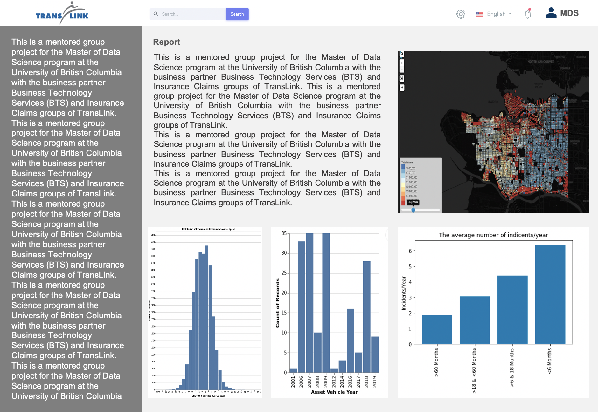

## Overview

- Introduction 
- Research Questions
- Data Overview
- Data Product
- Proposed Methodology
- Rough Timeline

<footer class = 'logo'>

</footer>

*** pnotes
- we are gonna walk you through 6 parts of the presentation and here is the map of our presentation to help you navigate.

--- {.build}

## Introduction

> * Premium paid to ICBC is the largest component of TransLink’s overall insurance budget and it has increased by over 200% since 2014/2015
> * In the past five years, claim costs have increased by about **122.5%**
> * Therefore, we have been asked to find:
    - strong predictors of claim severity/frequency that TransLink can leverage to help reduce costs

<footer class = 'cost'>

</footer>

<footer class = 'logo'>

</footer>

*** pnotes
- On average, premiums have increased by approximately $2 million, or 17.5%, per year during this period. 
- On average, TransLink has over 1,100 ICBC claims per year costing approximately $13 million per year.
- There are approximately 240 collision claims per year that on average cost $3.5K per claim
- The results of this data analysis would be used to develop loss mitigation plans that will avoid or reduce TransLink claims costs.

---
## Research Questions

<footer class = 'logo'>

</footer>

- What are the main predictors of the frequency and severity of bus accidents?
 
<footer class = 'logo'>

</footer>
 
*** pnotes
- The ... refer to other potential predictors of accident experience
- Categorical features include claim type codes (ATPA codes which are well defined categorical codes, and ATPA code descriptions that are written manually by a human) 
- 

---

## Research Questions (cont)

<footer class = 'logo'>

</footer>

- Within specific categorical features (such as claim type codes), are there specific clusters or groupings that are particularly noteworthy for having worse or better claims/accident experience?

---
## High Level Data Descriptions

- Bus Speeds for All Routes, Route Information
- Actual Incidient Reports
- Collisions (Preventable and Non-Preventable)
- Claims

<footer class = 'logo'>

</footer>

*** pnotes

- First one is , Speed Performance which as the name suggests gives information
about scheduled speeds and actual speeds with which the vehicle traveled along with the
scheduled and actual timings of the bus.
- Second dataset tells us about how different drivers are related with the different number
of incidents. This dataset gives a clear idea about the relationship of the drivers and their
characteristics with incidents.
- Third data set provides a detailed description of the collisions that took place, both
preventable and not preventable.
- Then at last, Translink will provide us the data about different claims that has been. We
so not have this data yet, this will be available in future.

--- {.build}

## Bus Speeds & Route Information

<footer class = 'logo'>

</footer>

---

<footer class = 'logo'>

</footer>

## Actual Incidient Reports

---

<footer class = 'logo'>

</footer>

## Collisions

---

<footer class = 'logo'>

</footer>

## Claims

---

<footer class = 'logo'>

</footer>

## Data Product

> * A reproducible, **interactive** report that allows the reader to:
    - .fragment visualize relationships between claim frequency/severity and specific variables interactively

---

<footer class = 'logo'>

</footer>

## Data Product (cont)

> * A fully reproducible data pipeline
    - .fragment user-friendly way to run the entire data analysis front to back using simple Make commands
    - .fragment stored on a Docker container
    - .fragment detailed documentation describing how to run the analysis and the code

---

<footer class = 'logo'>

</footer>

## Methodology

- Join all datasets together, split, exploratory data analysis, model, interpret
- Machine learning model that takes in multiple inputs at once
- Emphasis on models that can be interpreted (feature importance scores)

*** pnotes

- This is for the first research question
- We (hopefully) expect in the coming days the ability to JOIN the datasets together (operator incidents with claims and bus speeds) so that we can properly answer the specific predictive questions asked. This is essential!!!
- we are just going to try to understand the relationships initially
- exploratory data analysis: visualize distributions of variables of interest, box plots, histograms, etc.
- will try simple linear regression first and then work our way up

---

## Methodology (cont)

- Cluster Analysis for analysis of specific categorical features like claim type code, claim description (LDA, DBSCAN)

<footer class = 'logo'>

</footer>

*** pnotes

- This is for the second research question.
- Basically, try to understand specific categorical features related to claim descriptions/claim counts that allow us to understand patterns in particular types of claims and their severity

---

<footer class = 'logo'>

</footer>

